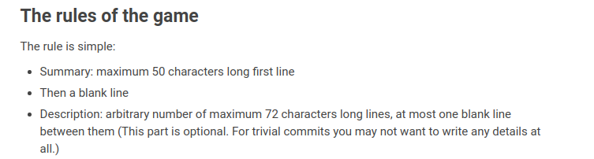
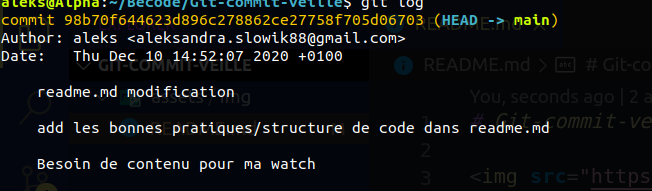
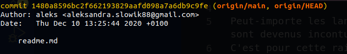

# Git-commit-veille

Peu importe les langages ou nos outils, nous utilisons les commits tous les jours. Git et github sont devenus incontournables dans le monde de programmation. Un bon commit devrai être bien structuré et lisible.
C'est pour cette raison que je voulais aborder ce sujet. Pour que nous devenions des pros du commit bien fait!

## Les bonnes pratiques:

- Commit souvent. C'est dur de s'y retrouver quand on ne commit pas assez et qu'il y'as trop de modifications apportés dans les fichiers/dossiers différents.

- Faire des commits sur plusieurs lignes
  - le titre:
    Se limiter a 50 caractères max (ce qui s'apelle 50/72 rule)
  - Description:
    Se limiter à 72 caractères. Être concis mais précis.
    
  - Footer (optionnel mais recommandé). Le pourquoi du changement.
    Surtout si on ne commente pas notre code, et quand on travaille en équipe certains membres ne savent pas pourquoi vous avez fait un changement.

## Structure idéale d'un commit

- Et en pratique:
  - a faire:
    - 
  - a éviter:
    - 

↪ [Next](SecondPage.md)
