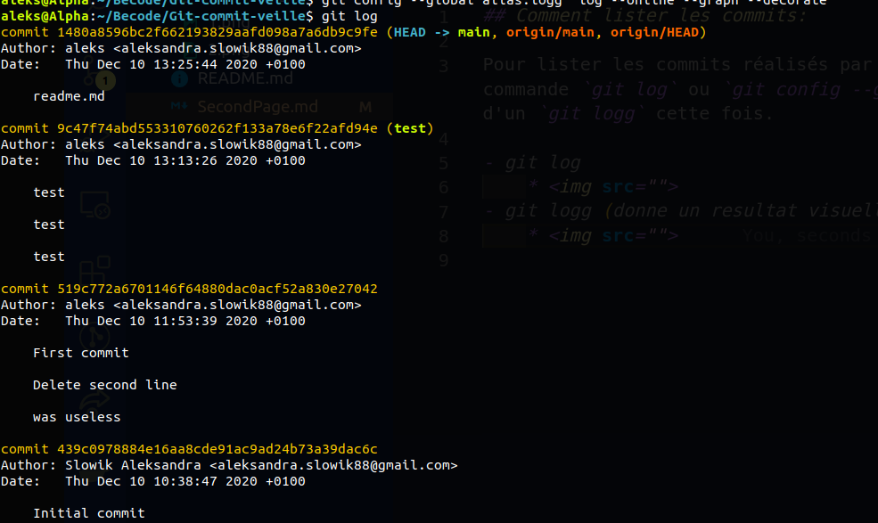
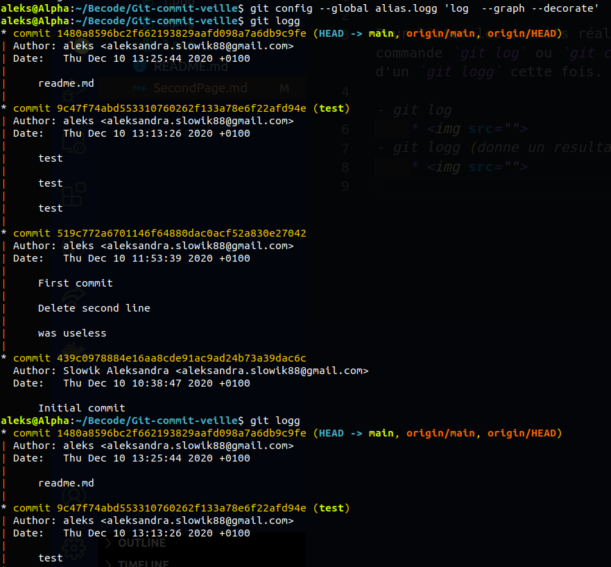

## Comment lister les commits:

Pour lister les commits réalisés par vous ou toute l'équipe il suffit de taper dans votre ligne de commande `git log` ou `git config --global alias.logg 'log  --graph --decorate'` suivi d'un enter et d'un `git logg` cette fois.

- git log
    * 
- git logg (donne un resultat visuellement plus agréable).
    * 
