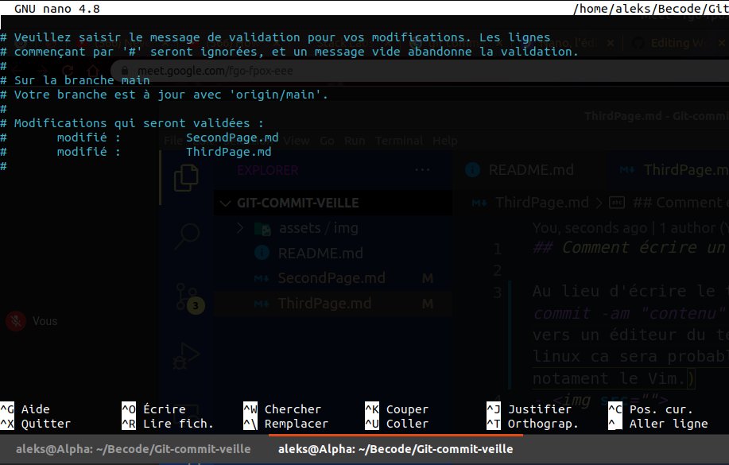
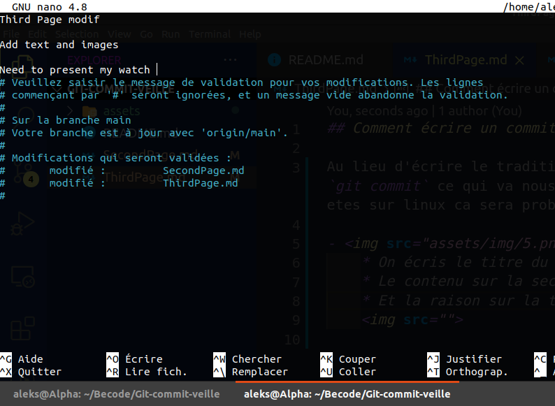
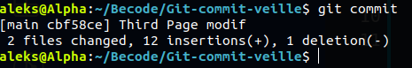
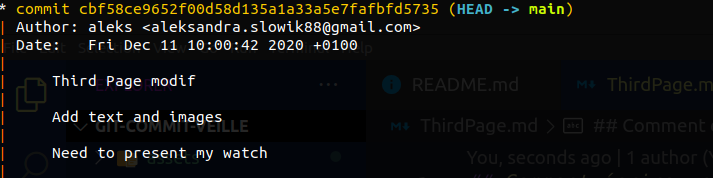
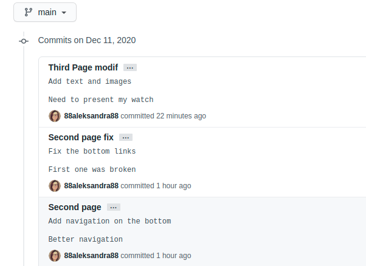

## Comment écrire un commit sur plusieurs lignes:

Au lieu d'écrire le traditionnel `git commit -m "contenu"` où le `git commit -am "contenu"` on écris: `git commit` ce qui va nous diriger vers un éditeur du texte (Dans mon cas c'est Gnu Nano, si vous êtes sur linux ça sera probablement le même. Mais il en existe plusieurs notamment le Vim.)

- 

  - On écrit le titre du commit sur la première ligne
  - Le contenu sur la seconde
  - Et la raison sur la troisième

    

On enregistre le message avec un `CTRL+o` tapez enter pour confirmer le nom du fichier a écrire puis un `CTRL+x` pour sortir (les commandes Nano peuvent différer de celles de Vim. En fonction de votre éditeur vous devez chercher celles qui correspondent). On voit des changements qui ont été fais.

Un coup de `git logg` pour checker:

Et un petit check sur les commits du repo pour voir comment ça se présente:

↪ [Previous](SecondPage.md)
↪ [Next](FourthPage.md)
